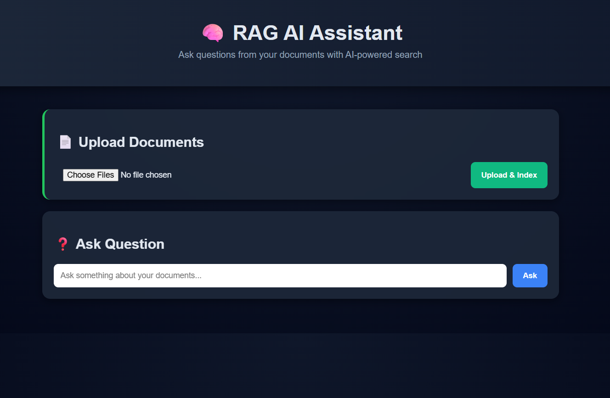
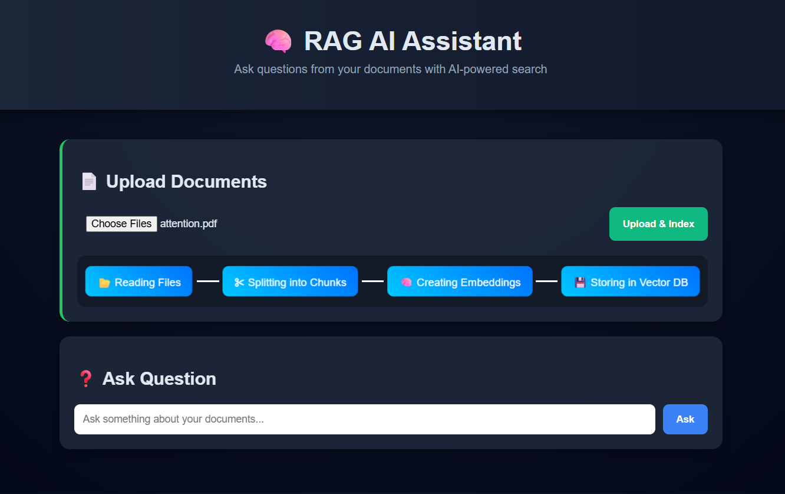
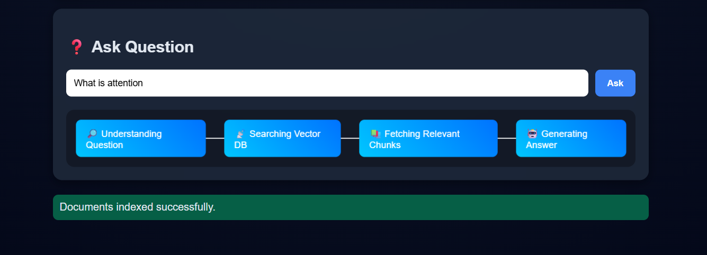
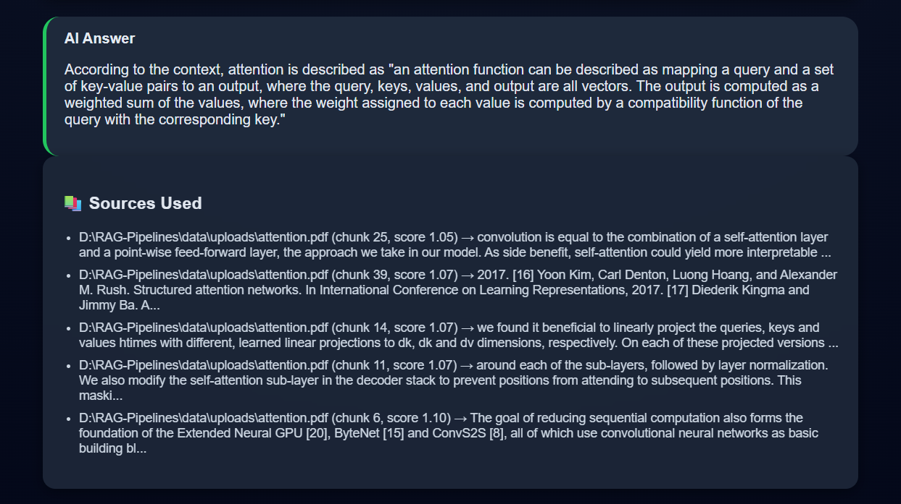

# 🧠 AI-Powered Document Assistant using RAG

An end-to-end **Retrieval-Augmented Generation (RAG)** system that allows users to upload documents and ask natural language questions, powered by **semantic search + vector embeddings + LLM reasoning**.

This project replicates the architecture behind modern AI tools like **ChatPDF, Perplexity AI, and enterprise knowledge assistants**.

---
🎥 **Live Demo Video:**  
👉 [Watch Project Demo](https://drive.google.com/file/d/1X2Z4zIo84fAWSYX0i3il8y4YbnWEDL7O/view?usp=sharing)

## 🚀 Key Features

* 📄 Upload multiple documents (PDF, TXT, CSV, Excel, DOCX, JSON)
* 🧩 Automatic document chunking
* 🧠 Embedding generation using Sentence Transformers (MiniLM)
* 🗄 Fast vector similarity search with FAISS
* 🤖 LLM-powered answer generation via Groq (LLaMA-3)
* 📚 Source citations with chunk traceability
* 🎬 Visual pipeline animations (Ingestion + Retrieval)
* 🌐 Clean AI-style web interface

---

## 🏗️ System Architecture

```
User Query
   ↓
Embedding Model (MiniLM)
   ↓
FAISS Vector Search
   ↓
Top Relevant Chunks Retrieved
   ↓
LLM (Groq) Context-based Answer Generation
   ↓
Answer + Citations
```

---

## 🧠 Tech Stack

| Layer            | Technology                    |
| ---------------- | ----------------------------- |
| Backend          | Python, Flask                 |
| Embeddings       | SentenceTransformers (MiniLM) |
| Vector Database  | FAISS                         |
| LLM              | Groq (LLaMA-3)                |
| Document Loaders | LangChain Community Loaders   |
| UI               | HTML, CSS, JavaScript         |
| Deployment Ready | Render / HuggingFace Spaces   |

---

## 📂 Project Structure

```
RAG-Pipelines/
│
├── app.py                  # Flask application
├── requirements.txt        # Dependencies
│
├── data/
│   └── uploads/            # User uploaded files
│
├── faiss_store/            # Vector index + metadata
│
├── src/
│   ├── data_loader.py      # Multi-format ingestion
│   ├── embedding.py        # Chunking + embedding logic
│   ├── vectorstore.py      # FAISS indexing & search
│   ├── search.py           # RAG retrieval + LLM
│   └── pipeline.py         # Orchestration layer
│
├── templates/
│   └── index.html          # Web UI
│
└── static/
    └── style.css           # UI styling
```

---

## ⚙️ How It Works

### 1️⃣ Document Ingestion

* Loads documents of various formats
* Splits them into semantic chunks

### 2️⃣ Embedding Creation

* Converts chunks into vector representations

### 3️⃣ Vector Storage

* Stores embeddings in FAISS for fast similarity search

### 4️⃣ Query Processing

* User question converted into embedding
* Most relevant chunks retrieved

### 5️⃣ Answer Generation

* Groq LLM summarizes answer using only retrieved context

### 6️⃣ Explainable AI

System returns:

* Answer
* Source file name
* Chunk ID
* Similarity score

---

## 🎬 Pipeline Visualizations

This system uniquely shows **what happens inside AI**:

### 📤 Ingestion Pipeline

```
Document → Chunking → Embeddings → Vector DB
```

### 🔎 Retrieval Pipeline

```
Question → Vector Search → Context Retrieval → LLM → Answer
```

---

## 🖥️ Run Locally

```bash
git clone <repo-url>
cd RAG-Pipelines
pip install -r requirements.txt

# Add API key
echo "GROQ_API_KEY=your_key_here" > .env

python app.py
```

Visit:

```
http://127.0.0.1:5000
```

---
## 📸 Screenshots

### 🖥️ Main Interface
Clean AI-style interface for document upload and question answering.



---

### 📤 Document Ingestion Pipeline
Behind-the-scenes visualization of how documents are:
- Split into chunks
- Converted to embeddings
- Stored in FAISS vector database



---

### 🧠 AI Answer Generation
LLM generates context-aware responses using only retrieved document chunks.



---

### 📚 Source Attribution (Explainable AI)
System shows:
- File name  
- Chunk ID  
- Similarity score  
- Source text snippet  



---

## 🔮 Future Improvements

* Chat-style conversation memory
* Streaming LLM responses
* Persistent cloud storage
* Authentication system
* Advanced ranking algorithms

---

## 👨‍💻 Author

**Jay Shimpi**

AI & Data Science Engineer

---

⭐ If you like this project, give it a star!

---
